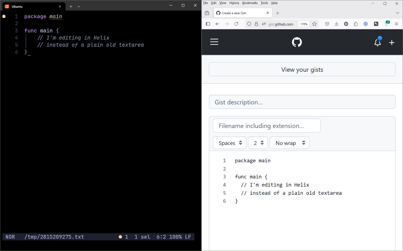

# 👻 helix-ghost

Edit web browser textareas in [Helix](https://helix-editor.vercel.app/)!

## Overview

[GhostText](https://ghosttext.fregante.com/) is a browser extension that lets you edit textarea content in your
favorite editor instead of in the browser. This is good if, for example, you like
the way your editor highlights and lints your code. Or maybe you like the way your
editor spellchecks your markdown. I just like the simplicity of Helix and look for
more places to use it, in general.

There are GhostText clients for lots of editors out there, but there wasn't one for
Helix. So I made this one. Since Helix doesn't have a plug-in system, scripting, etc.,
this was a little tricky. And the result is more basic than some of the other, more
complex editor plug-ins for GhostText. (This tracks with how Helix's simplicity
demands that you think simpler, which is the main thing I like about it.)

## Installation

1. Install the GhostText extension for [Firefox](https://addons.mozilla.org/en-US/firefox/addon/ghosttext/) or
   [Chrome](https://chromewebstore.google.com/detail/ghosttext/godiecgffnchndlihlpaajjcplehddca?pli=1)
2. Install the software in this repo by downloading the appropriate binary in the [Releases](releases) tab and
   placing it in a folder that's in your PATH. Or just install it using Go by typing:
  `go install github.com/rahji/helix-ghost@latest`

## Usage

Once it's installed, you can run this software by opening your terminal application
and typing `helix-ghost`.

Open a web page that has a textarea and click the GhostText extension icon.

Back in that terminal window, you should see Helix running with the text from your browser.
Every time you save (`:w`) in Helix, the browser's textarea will be updated to reflect
what you've done in the editor.

When you quit Helix, the connection will be closed. The software continues running in your
terminal, waiting for the next connection from your browser.

If you want to quit the helix-ghost server altogether, use `Ctrl+C`

## Notes and Limitations

* Helix assumes the file is plain text. If you want to switch to something like Markdown or some programming
  language, you can use the helix command `:set-language`
* I've tested this in Windows and WSL (Ubuntu) and it works with both. Let me know if you try it with another OS.
* Only one textarea on the page can be edited at a time. You'll need to quit Helix if you want to
  edit another textarea.
* Since the GhostText protocol doesn't seem to provide a nice way of closing the connection, you'll
  briefly see a red error message appear when you quit Helix (which closes the connection).

## Support

If this is useful for you, add a star in GitHub. Then please consider donating a few bucks to
[World Central Kitchen](https://www.worldcentralkitchen.org/)
